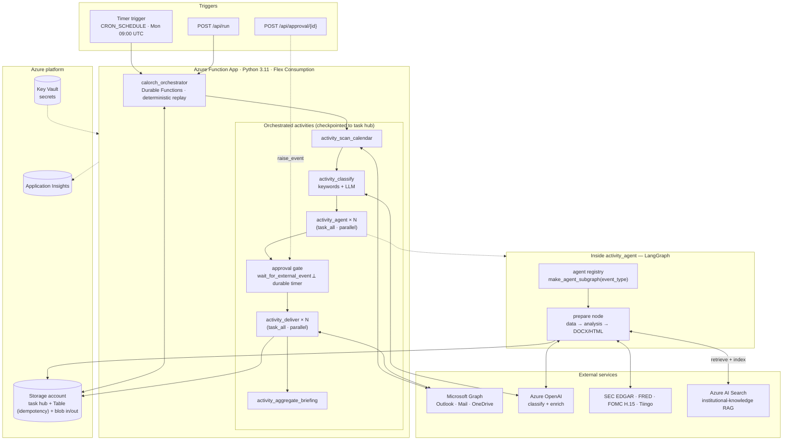

# Calorch

> **Enterprise-Grade Calendar-Driven Intelligent Workflow Orchestrator**
>
> **Azure Durable Functions** orchestrator with **LangGraph** multi-agent
> subgraphs for equity research prep-pack automation. Ingests Outlook
> calendar events, classifies them into 8 research workflows, enriches with
> live SEC EDGAR / FRED / FOMC H.15 data, generates DOCX briefs with
> LLM-powered narrative, and delivers HTML emails via Microsoft Graph — all
> fanned out in parallel, with a human-in-the-loop approval gate.



The orchestrator (Durable Functions) owns flow control — sequencing,
parallel fan-out/fan-in, retries, the approval gate, durable timers — and
stays deterministic (no I/O, clock from `context.current_utc_datetime`).
All side effects live in **activities**, which the host checkpoints and
retries. The agent work runs inside `activity_agent` as a compiled
LangGraph subgraph selected from the [agent registry](#adding-a-new-agent).

---

## Enterprise Data Architecture

All data flows through a **Protocol-based provider layer** (`src/calorch/providers.py`). The renderer never knows which implementation is wired — swapping Tiingo for Refinitiv or Bloomberg is a config change, not a code change.

### Provider Priority Chain

| Priority | Source | Data | Authentication | SLA |
|----------|--------|------|---------------|-----|
| 1 | **SEC iXBRL Company Facts** | Revenue, EPS, gross/operating/net margins, ROE, ROA, assets, liabilities, cash, debt, capex, R&D, shares outstanding | None (free, ToS-compliant) | Best-effort |
| 2 | **SEC iXBRL Instance Docs** | Product segment revenue, geographic revenue (parsed from inline XBRL on 10-Q/10-K) | None (free) | Best-effort |
| 3 | **SEC EFTS** | Full-text filing search — guidance, outlook, risk factor excerpts | None (free) | Best-effort |
| 4 | **FOMC H.15** | Full Treasury yield curve (1M→30Y) + effective federal funds rate | None (free, scraped) | Daily |
| 5 | **FRED** | VIX, S&P 500, WTI oil, gold, BTC, CPI, unemployment, USD/EUR | Optional key (free) | Real-time |
| 6 | **Tiingo** | EOD price, market cap, analyst consensus, price targets | API key ($50/mo) | Delayed |

### Provider Contract

```python
class PriceProvider(Protocol):
    def quote(self, ticker: str) -> dict[str, Any]: ...

class ConsensusProvider(Protocol):
    def estimates(self, ticker: str) -> dict[str, Any]: ...
    def recommendations(self, ticker: str) -> dict[str, Any]: ...

class FundamentalsProvider(Protocol):
    def latest_fundamentals(self, cik: str, ticker: str) -> dict[str, Any]: ...

class MacroProvider(Protocol):
    def snapshot(self) -> dict[str, dict[str, Any]]: ...

class SegmentProvider(Protocol):
    def latest_segments(self, cik: str, ticker: str, *, axis: str = "product") -> list[dict[str, Any]]: ...

class NarrativeProvider(Protocol):
    def guidance_hits(self, cik: str, ticker: str, *, limit: int = 5) -> list[dict[str, Any]]: ...
```

In production the orchestrator reads **pre-ingested** provider data from
Azure Blob Storage (`USE_BLOB_PROVIDERS=true`); a separate ingestion
pipeline (`calorch.data_ingestion`) populates `calorch-inputs` on its own
schedule. When a provider lacks credentials it returns empty data
(`{"note": "TIINGO_API_KEY not set", "source": "none"}`) — never an
exception, never a stub leaking into output.

---

## Template System

All 8 event types are defined as JSON templates (`src/calorch/data/templates/`, shipped inside the package) modeled on real equity research prep packs. Zero hardcoded content in Python.

```json
{
  "event_type": "earnings_call",
  "sections": [
    {
      "id": "executive_snapshot",
      "title": "Executive Snapshot",
      "source": "llm",
      "llm_method": "enrich_headline",
      "fallback": ["{primary_ticker} earnings — see data tables above."],
      "prompt_addendum": "Write 3-4 crisp bullet points..."
    },
    {
      "id": "last_quarter",
      "title": "Last Quarter Performance",
      "source": "data",
      "table_type": "two_col",
      "rows": [
        {"label": "EPS Actual", "value": "{eps_actual}"}
      ]
    }
  ]
}
```

**Template Engine** (`src/calorch/templates.py`):
- `load_template(name | EventType | Path)` — loads a built-in template or an explicit file path (for out-of-tree agents)
- `TemplateEngine.build(context, data_tables)` — resolves variables, dispatches LLM calls, builds `EventAnalysis`

---

## LLM Enrichment Layer

### Classification (model-agnostic)
Uses `llm.invoke()` with a JSON prompt — no `response_format` / JSON mode requirement. Works with DeepSeek, kimi, GLM, and Azure OpenAI. Parse robust — handles markdown fences, inline JSON, and raw JSON.

### Enrichment (all 8 event types)
`LlmEnricher` generates narrative bullets via section-specific prompts. Each section has a `prompt_addendum` in the template.

### Safety Controls

| Control | Implementation |
|---------|---------------|
| **Grounding Rule** | "ONLY use data explicitly provided in context. Do NOT use training data." |
| **Thinking-Block Filter** | 150+ phrase blacklist + 70% threshold. If model outputs reasoning, response is discarded and template fallback is used |
| **Fallback Content** | Every template section has data-driven fallback — no blank sections |

### Institutional-knowledge RAG (Azure AI Search)

When `AZURE_SEARCH_ENDPOINT` is configured, enrichment LLM calls are
augmented with retrieved prior research (`calorch.knowledge`):

- **Retrieve** — before each enrichment call, `RagChatModel` queries Azure
  AI Search with the section prompt (filtered to the event's ticker) and
  injects the top-K passages into the prompt as *additional provided
  context*, so the model grounds new briefs in the firm's own research
  history without violating the no-training-data rule.
- **Index** — after each event's analysis is built, its structured record
  (title + section text + tickers + confidence) is upserted into the
  index, so the corpus grows with every run (`KNOWLEDGE_WRITEBACK`).

It's a *derived* index over the `calorch-outputs` blob corpus, never a
system of record. Unconfigured → `NullKnowledgeStore` → the whole feature
is a zero-overhead no-op (the default in local/demo runs). Retrieval and
indexing are both best-effort: a Search outage degrades to un-augmented
enrichment, never a failed run.

---

## Orchestration — Azure Durable Functions

The production orchestrator is an Azure Durable Functions app
(`function_app.py` → `calorch.durable`). The orchestrator function
sequences activities; the parallel stages use `task_all`; the approval
gate races an external event against a durable timer.

```
calorch_orchestrator                       (deterministic — no I/O, no wall clock)
  → activity_scan_calendar                 (Microsoft Graph — Outlook calendar)
  → activity_classify                      (Pass 1 keywords/SEC form + Pass 2 LLM JSON)
  → task_all(activity_agent × N)           (parallel — one LangGraph agent per event)
  → approval gate                          (wait_for_external_event ⟂ durable timer, 24h)
  → task_all(activity_deliver × N)         (parallel — draft/send, OneDrive, repository)
  → activity_aggregate_briefing            (cross-event weekly summary → blob)
```

### Functions in the app (13)

| Function | Trigger | Responsibility |
|---|---|---|
| `calorch_orchestrator` | orchestration | Sequences the workflow above; deterministic replay |
| `timer_start` | timer (`CRON_SCHEDULE`) | Starts a scheduled run (default Mon 09:00 UTC, 7-day lookahead) |
| `http_start` | `POST /api/run` | Starts a run on demand; returns the status-query URLs |
| `http_approval` | `POST /api/approval/{id}` | Raises the `approval` event (function-key auth; for API/automation) |
| `http_status` | `GET /api/status/{id}` | Reports run status counts (no bodies) |
| `http_review` | `GET /api/review/{id}?token=…` | Approval review page — renders the prepared previews (anonymous + one-time token) |
| `http_decision` | `POST /api/decision/{id}` | Records the approve/reject decision from the review page (anonymous + token) |
| `activity_scan_calendar` | activity | Pulls calendar events from Graph |
| `activity_classify` | activity | Two-pass classification (keywords/SEC form + LLM) |
| `activity_agent` | activity | Runs the LangGraph agent subgraph for one event |
| `activity_deliver` | activity | Idempotent draft/send + calendar patch + repository upsert |
| `activity_aggregate_briefing` | activity | Builds the weekly HTML briefing |
| `activity_request_approval` | activity | Emails approvers the run summary + review-page link |

### Approval workflow

When a send run pauses at the gate, the addresses in `APPROVER_EMAILS` get
an email (via Graph) summarising the prepared emails, with one link to the
**review page**: the actual email previews rendered inline, plus Approve /
Reject buttons. The link carries a **per-run one-time token** (its SHA-256
lives in the orchestration's `custom_status`) — no function key in any
email, and the token dies with the run. The emailed link is a read-only GET
and decisions are POST-only forms, so mail scanners that prefetch links
(Outlook SafeLinks) can never trigger an approval. The key-protected
`POST /api/approval/{id}` remains for automation.

### Why Durable Functions

- **Durable approval gate** — `wait_for_external_event("approval")` raced
  against a `create_timer` deadline (default 24h, per-run override). While
  paused the app scales to zero — no compute cost during human review.
- **Deterministic replay** — `run_id` is derived from
  `context.current_utc_datetime`; the orchestrator does no I/O.
- **At-least-once activities with retry** — every activity runs with
  `RetryOptions(3 attempts)`; delivery is idempotent per `run_id:event_id`
  (recorded in the repository) so a retry can't double-send.
- **Task hub on Azure Storage** — no extra checkpoint database; the
  `CalorchTaskHub` (see `host.json`) lives in the function app's storage
  account. `functionTimeout` is 30 min (Flex Consumption), so a single
  long activity won't hit the classic 10-min Consumption cap.

### LangGraph runtime (local dev)

`calorch.graph.make_graph` still assembles the equivalent pipeline as a
LangGraph `StateGraph` (registry-driven agents, `Send` fan-out,
`interrupt()` approval, in-memory checkpoints). It's used for
`langgraph dev` and unit tests; the Durable Functions app is the
deployment target.

---

## Supported LLM Providers

| Provider | Models | Authentication | Notes |
|----------|--------|---------------|-------|
| **Azure OpenAI** | `gpt-4o`, `gpt-4o-mini` | `AZURE_OPENAI_API_KEY` + endpoint | Default production LLM |
| **Opencode Go** | `deepseek-v4-pro`, `deepseek-v4-flash`, `kimi-k2.5`, `kimi-k2.6`, `glm-5.1`, `glm-5` | `OPENCODE_GO_API_KEY` | OpenAI-compatible endpoint; overrides Azure OpenAI when set |
| **Mock** | `MockChatModel` | none | `USE_MOCKS=true` — deterministic, for demo/tests |

---

## Project Structure

```
calorch/
├── function_app.py                   # Azure Functions entry point (registers durable blueprints)
├── host.json                         # Functions host config + durableTask task hub
├── local.settings.json               # Local Functions settings (func start)
├── pyproject.toml
├── langgraph.json                    # `langgraph dev` entry (graph.make_graph)
├── .env.example
├── src/calorch/
│   ├── data/                         # packaged data (ships in the wheel)
│   │   ├── seed_events.json          #   demo events (USE_MOCKS=true)
│   │   └── templates/                #   8 JSON report templates
│   ├── durable/                      # Azure Durable Functions orchestration (deployment)
│   │   ├── orchestrator.py           #   orchestrator + timer/HTTP triggers + approval gate
│   │   ├── activities.py             #   5 activities wrapping nodes/agents
│   │   └── state.py                  #   JSON (de)serialization adapter
│   ├── agents/                       # Modular per-event-type agents
│   │   ├── base.py                   #   AgentSpec, registry, default subgraph factory
│   │   └── builtin/                  #   one self-contained module per event type
│   │       ├── earnings_call.py      #     keywords + analysis builder + register()
│   │       └── ...                   #     (8 more)
│   ├── graph.py                      # LangGraph StateGraph (local dev / tests)
│   ├── nodes.py                      # Node functions + per-event pipeline
│   ├── state.py                      # TypedDict state, Pydantic models, enums
│   ├── config.py                     # Settings from environment
│   ├── analysis.py                   # EventAnalysis + shared builder toolkit
│   ├── renderers.py                  # DOCX (python-docx) + HTML email rendering
│   ├── _earnings_helpers.py          # Financial table builders + formatters
│   ├── templates.py                  # Template engine — JSON → EventAnalysis
│   ├── llm.py / llm_enrich.py        # LLM factory + enrichment with thinking-block filter
│   ├── providers.py                  # Protocol-based live data layer
│   ├── data_ingestion.py             # Blob ingestion pipeline (SEC/FRED/Tiingo → calorch-inputs)
│   ├── blob_store.py                 # Azure Blob Storage (inputs/outputs) + local fallback
│   ├── tools.py                      # GraphClient, OneDrive, Repository, make_providers
│   ├── sec.py / sec_ixbrl.py / sec_efts.py  # SEC EDGAR clients
│   ├── fred.py / fed_h15.py / tiingo.py     # Macro + price clients
│   └── cli.py                        # `calorch run / summary / serve` (serve = langgraph dev)
├── tests/                            # tests (test_durable, test_agents, test_graph, …)
├── docs/
│   ├── architecture.md / .html       # Durable Functions architecture
│   └── evaluations/                  # ADR, data-source, implementation reviews
├── deploy/
│   └── azure-functions.md            # ► Azure Durable Functions deployment guide
└── scripts/                          # run_demo, run_sec, render_architecture
```

---

## Quick Start

### Local — demo (no keys)

```bash
python -m pip install -e .

# end-to-end on seed data with MockChatModel
python scripts/run_demo.py
# or the CLI
python -m calorch.cli run --start 2026-06-01 --end 2026-06-08
```

### Local — Durable Functions host

Requires [Azure Functions Core Tools v4](https://learn.microsoft.com/azure/azure-functions/functions-run-local) and a storage emulator (Azurite):

```bash
pip install -e .
func start                      # indexes the 10 functions from function_app.py

# trigger a run (draft mode)
curl -X POST http://localhost:7071/api/run \
  -H "Content-Type: application/json" \
  -d '{"start":"2026-06-08T00:00:00Z","end":"2026-06-15T00:00:00Z","send_emails":false}'
```

### Deploy to Azure

See **[deploy/azure-functions.md](deploy/azure-functions.md)** — the full
guide for the Durable Functions app: provisioning, app settings, Microsoft
Graph registration, smoke tests, CI/CD, and troubleshooting.

---

## Environment Variables

See `src/calorch/config.py` for the authoritative list and defaults.

| Variable | Required | Purpose |
|----------|----------|---------|
| `AZURE_OPENAI_API_KEY` + `AZURE_OPENAI_ENDPOINT` | Yes (prod LLM) | Azure OpenAI classification + enrichment |
| `AZURE_OPENAI_DEPLOYMENT` | No | Chat deployment (default `gpt-4o`) |
| `OPENCODE_GO_API_KEY` / `OPENCODE_GO_MODEL` | No | OpenAI-compatible alt; overrides Azure OpenAI |
| `CRON_SCHEDULE` | No | Timer NCRONTAB (default `0 0 9 * * 1` = Mon 09:00 UTC) |
| `APPROVER_EMAILS` | No | CSV of addresses notified when a send run awaits approval (empty = no email; gate still works via API) |
| `APPROVAL_BASE_URL` | No | Base URL for emailed review links (default `https://$WEBSITE_HOSTNAME`) |
| `GRAPH_TENANT_ID` / `GRAPH_CLIENT_ID` / `GRAPH_CLIENT_SECRET` | Yes (prod) | Entra ID app registration for Microsoft Graph |
| `GRAPH_USER_ID` | No | Mailbox/calendar UPN (default `me`) |
| `ONEDRIVE_DRIVE_ID` | No | OneDrive target for DOCX archive |
| `AZURE_STORAGE_ACCOUNT_URL` *or* `AZURE_STORAGE_CONNECTION_STRING` | Yes (prod) | Blob persistence (`calorch-inputs`/`calorch-outputs`); account URL = managed identity |
| `USE_BLOB_PROVIDERS` | No | Read pre-ingested data from blob (default `true`) |
| `REPO_BACKEND` | No | `table` (prod — Azure Table for delivery idempotency, in the storage account) or `json` (local); `REPO_TABLE_NAME` names the table |
| `AZURE_SEARCH_ENDPOINT` / `AZURE_SEARCH_INDEX` / `AZURE_SEARCH_API_KEY` | No | Azure AI Search RAG over the research corpus — empty disables it (no-op) |
| `AZURE_SEARCH_SEMANTIC_CONFIG` / `RAG_TOP_K` / `KNOWLEDGE_WRITEBACK` | No | Semantic-ranking config name; passages retrieved per enrichment call (default 4); index each prepared analysis (default `true`) |
| `OUTPUT_DIR` / `SEC_CACHE_DIR` / `AUDIT_LOG_PATH` | Yes (Azure) | Point at `/tmp/...` — the package mount is read-only |
| `SEC_USER_AGENT` | Yes (prod) | `"Your Name you@example.com"` — SEC requires a real contact |
| `SEC_WATCHLIST` | No | Ingestion tickers (default 10 mega-caps) |
| `TIINGO_API_KEY` / `FRED_API_KEY` | No | Prices/consensus; macro |
| `USE_FRED` / `USE_FED_H15` / `USE_IXBRL_SEGMENTS` / `USE_SEC_EFTS` | No | Toggle free sources (default `true`) |
| `USE_MOCKS` | No | `true` = MockChatModel + seed events (default `true`) |
| `CALORCH_AGENT_MODULES` | No | Comma-separated import paths of out-of-tree agent modules |
| `LANGSMITH_API_KEY` / `LANGSMITH_PROJECT` / `LANGSMITH_TRACING` | No | LangSmith tracing of agent subgraphs |

---

## Event Types

| Type | Template | LLM Enrichment | SEC Data |
|------|----------|---------------|----------|
| `earnings_call` | `earnings_call.json` | Executive snapshot, guidance, margin walk, risk factors, key questions | iXBRL fundamentals + segments + EFTS guidance |
| `management_meeting` | `management_meeting.json` | Executive summary, key questions, risk factors | iXBRL segments + macro |
| `conference` | `conference.json` | Company overview, key questions for 1x1s, risk factors | Fundamentals + macro |
| `kol_meeting` | `kol_meeting.json` | Pre-call research, hypotheses | N/A (people-based) |
| `channel_check` | `channel_check.json` | Revenue overview, questionnaire (15-20 Q), risk factors | Fundamentals + EFTS |
| `portfolio_meeting` | `portfolio_meeting.json` | Key movers, discussion items | FRED + H.15 (macro) |
| `internal_review` | `internal_review.json` | Performance review, key questions, risk factors | N/A |
| `analyst_meeting` | `analyst_meeting.json` | Executive summary, key questions, risk factors | Fundamentals |

### Adding a new agent

Each event-type agent is a self-contained module that registers an
`AgentSpec` (classification keywords + analysis builder + optional custom
subgraph). The orchestrator, the Durable Functions activities, the Send
fan-out and the keyword classifier all consult the registry, so adding an
agent touches nothing else.

1. **Add the type** to `EventType` in `src/calorch/state.py` (the
   classifier's typed vocabulary).
2. **Write one module** that registers the agent:

   ```python
   # src/calorch/agents/builtin/ipo_roadshow.py
   from calorch.agents.base import AgentSpec, register
   from calorch.analysis import EventAnalysis, base_analysis, build_with_template
   from calorch.state import EventType

   def build_ipo_roadshow(ev, cls, ed, llm_call, *, providers=None, cik_lookup=None) -> EventAnalysis:
       a = base_analysis(f"IPO Roadshow — {ev.subject}", ev, cls, ed)
       ctx = {"event_id": ev.id, "confidence": cls.confidence, "tickers": a.tickers}
       return build_with_template("ipo_roadshow", ctx, {}, llm_call, providers)

   register(AgentSpec(
       event_type=EventType.IPO_ROADSHOW,
       analysis_builder=build_ipo_roadshow,
       keywords=("ipo", "roadshow", "s-1"),
   ))
   ```
3. **Make it import.** For in-tree agents, add it to
   `src/calorch/agents/builtin/__init__.py`. For deployment-specific agents
   shipped outside the package, list the module path in the
   `CALORCH_AGENT_MODULES` env var (comma-separated) — no repo edit needed.
   Such agents can pass an absolute `Path` as the template to
   `build_with_template`, so they need zero files inside the package tree.

Agents needing a richer shape than the default single prepare node (extra
tool nodes, inner loops) pass `graph_factory=` to `AgentSpec` to build
their own `StateGraph`; it only has to honour `AgentInput`/`AgentOutput`.
To replace a built-in agent, `register(..., replace=True)`.

---

## Cost Profile (Weekly Run)

Azure Durable Functions on **Flex Consumption** (scale-to-zero, per-execution billing).

| Component | Monthly Cost |
|---|---|
| Function App (Flex Consumption) | ~$0 idle + pennies/run |
| Storage account (task hub + artifacts) | <$1.00 |
| Azure OpenAI (~100 calls/week) | ~$8–20 (token-driven) |
| SEC EDGAR + FRED + FOMC H.15 (unlimited, fair-use) | Free |
| Tiingo EOD (optional) | $50.00 |
| Azure Table Storage (delivery idempotency) | ~$0 (cents) |
| Azure AI Search (optional — institutional-knowledge RAG) | $0 Free tier / ~$75 Basic |
| Azure Key Vault | ~$1.00 |
| Application Insights + Log Analytics | ~$5.00 |
| **Total (without Tiingo)** | **~$15–28/mo** |
| **Total (with Tiingo)** | **~$65–78/mo** |

The approval pause costs nothing — state waits in the task hub, not on a running instance.

---

## Tests

```bash
# Full suite (no network — MockChatModel + inline HTTP mocks)
python -m pytest tests/ -q

# Key modules
python -m pytest tests/test_durable.py -q       # Durable orchestrator (fake context)
python -m pytest tests/test_agents.py -q        # Agent registry + extensibility
python -m pytest tests/test_agent_builders.py -q # Per-type builder snapshots
python -m pytest tests/test_graph.py -q         # End-to-end LangGraph pipeline
python -m pytest tests/test_providers.py -q     # Provider dispatch
python -m pytest tests/test_sec_providers.py -q # iXBRL + EFTS
```

**201 tests** (one pre-existing rate-limiter GC test is a known failure on
`main`, unrelated to orchestration). The durable suite drives the
orchestrator generator with a fake context across the no-event, draft,
approve, reject, and timeout paths — no Azure runtime required.

---

## Enterprise Hardening

### Application-level
- **Structured JSON logging** (`calorch.logging_config`) — one JSON object per line, ready for App Insights / Log Analytics ingest. Set `LOG_FORMAT=json`.
- **Request/run ID propagation** through `contextvars` — every log line and span carries the same correlation ID.
- **PII redaction** in the log formatter — emails, SSN, phone numbers, bearer tokens, and API keys are redacted before emission.
- **OpenTelemetry traces** (`calorch.telemetry`) — spans on every node, agent subgraph, LLM call, and HTTP request. `pip install calorch[otel]`; set `OTEL_EXPORTER_OTLP_ENDPOINT`.
- **Shared HTTP client** (`calorch.http_client`) — connection pooling, exponential-backoff retry (tenacity), circuit breaker. All external data sources use it.
- **Idempotent delivery** — `deliver_event` checks the repository for an existing `delivery_key` before sending; combined with activity retries this guarantees at-most-once email send.
- **SEC fair-use** — thread-safe rate limiter (≤10 req/sec) + on-disk cache.

### Handled by the Azure platform (Durable Functions)
- **HTTP auth** — the `run`/`approval`/`status` triggers use Azure **function keys** (`?code=`); distribute the approval key only to approvers. Rotate via `az functionapp keys set`.
- **Scaling & timeouts** — the Functions host scales 0→N and enforces `functionTimeout` (30 min); a hung activity is killed by the host.
- **Retries** — `RetryOptions(3 attempts)` on every activity; transient Graph/SEC/LLM failures are retried automatically.
- **Secrets** — Key Vault references in app settings; managed identity for blob/table/search.
- **Observability** — Application Insights wired at app creation; durable instance state queryable via `func durable` and `GET /api/status/{id}`.

| Var | Default | Purpose |
|---|---|---|
| `LOG_FORMAT` | `text` | `json` for log aggregation |
| `LOG_LEVEL` | `INFO` | Root log level |
| `OTEL_EXPORTER_OTLP_ENDPOINT` | unset | OTLP collector URL (optional) |

---

## Data Sources Table

Every generated report includes a Data Sources table showing provenance:

| Provider | Status | Detail |
|----------|--------|--------|
| SEC iXBRL Fundamentals | ACTIVE | Revenue, EPS, margins, balance sheet, cash flow |
| SEC iXBRL | ACTIVE | Company facts + segment revenue |
| SEC EFTS | ACTIVE | Full-text filing search |
| FRED | ACTIVE | Federal Reserve Economic Data |
| FOMC H.15 | ACTIVE | US Treasury / Fed rates |
| Tiingo | MISSING | TIINGO_API_KEY not set |

---

## License

Internal — Confidential.
