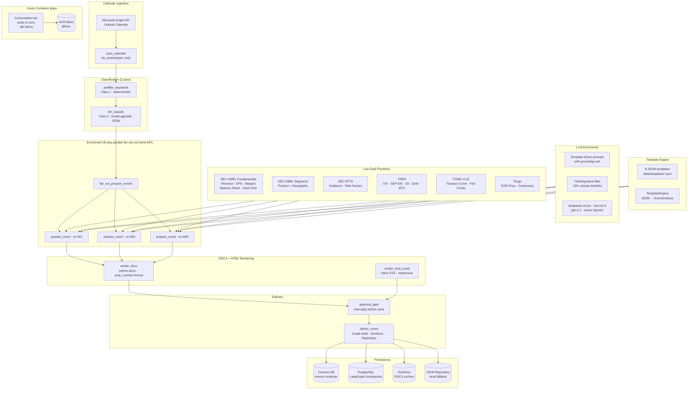

# Calorch

> **Enterprise-Grade Calendar-Driven Intelligent Workflow Orchestrator**
>
> LangGraph + Azure Container Apps engine for equity research prep-pack automation.
> Ingests Outlook calendar events, classifies them into 8 research workflows, enriches
> with live SEC EDGAR / FRED / FOMC H.15 data, generates DOCX briefs with LLM-powered
> narrative, and delivers HTML emails via Microsoft Graph — all in parallel.



---

## Enterprise Data Architecture

All data flows through a **Protocol-based provider layer** (`src/calorch/providers.py`). The renderer never knows which implementation is wired — swapping Tiingo for Refinitiv or Bloomberg is a config change, not a code change.

### Provider Priority Chain

| Priority | Source | Data | Authentication | SLA |
|----------|--------|------|---------------|-----|
| 1 | **SEC iXBRL Company Facts** | Revenue, EPS, gross/operating/net margins, ROE, ROA, assets, liabilities, cash, debt, capex, R&D, shares outstanding | None (free, ToS-compliant) | Best-effort |
| 2 | **SEC iXBRL Instance Docs** | Product segment revenue, geographic revenue (parsed from inline XBRL on 10-Q/10-K) | None (free) | Best-effort |
| 3 | **SEC EFTS** | Full-text filing search — guidance, outlook, risk factor excerpts | None (free) | Best-effort |
| 4 | **FOMC H.15** | Full Treasury yield curve (1M→30Y) + effective federal funds rate | None (free, scraped) | Daily |
| 5 | **FRED** | VIX, S&P 500, WTI oil, gold, BTC, CPI, unemployment, USD/EUR | Optional key (free) | Real-time |
| 6 | **Tiingo** | EOD price, market cap, analyst consensus, price targets | API key ($50/mo) | Delayed |

### Provider Contract

```python
class PriceProvider(Protocol):
    def quote(self, ticker: str) -> dict[str, Any]: ...

class ConsensusProvider(Protocol):
    def estimates(self, ticker: str) -> dict[str, Any]: ...
    def recommendations(self, ticker: str) -> dict[str, Any]: ...

class FundamentalsProvider(Protocol):
    def latest_fundamentals(self, cik: str, ticker: str) -> dict[str, Any]: ...

class MacroProvider(Protocol):
    def snapshot(self) -> dict[str, dict[str, Any]]: ...

class SegmentProvider(Protocol):
    def latest_segments(self, cik: str, ticker: str, *, axis: str = "product") -> list[dict[str, Any]]: ...

class NarrativeProvider(Protocol):
    def guidance_hits(self, cik: str, ticker: str, *, limit: int = 5) -> list[dict[str, Any]]: ...
```

When a provider lacks credentials, it returns empty data with `{"note": "TIINGO_API_KEY not set", "source": "none"}` — never an exception, never a stub, never a mock.

---

## Template System

All 8 event types are defined as JSON templates (`data/templates/`) modeled on real equity research prep packs. Zero hardcoded content in Python.

```json
{
  "event_type": "earnings_call",
  "sections": [
    {
      "id": "executive_snapshot",
      "title": "Executive Snapshot",
      "source": "llm",
      "llm_method": "enrich_headline",
      "fallback": ["{primary_ticker} earnings — see data tables above."],
      "prompt_addendum": "Write 3-4 crisp bullet points..."
    },
    {
      "id": "last_quarter",
      "title": "Last Quarter Performance",
      "source": "data",
      "table_type": "two_col",
      "rows": [
        {"label": "EPS Actual", "value": "{eps_actual}"}
      ]
    }
  ]
}
```

**Template Engine** (`src/calorch/templates.py`):
- `load_template(event_type)` — loads JSON template
- `TemplateEngine.build(context, data_tables)` — resolves variables, dispatches LLM calls, builds `EventAnalysis`

---

## LLM Enrichment Layer

### Classification (model-agnostic)
Uses `llm.invoke()` with a JSON prompt — no `response_format` / JSON mode requirement. Works with DeepSeek, kimi, GLM, and Azure OpenAI. Parse robust — handles markdown fences, inline JSON, and raw JSON.

### Enrichment (all 8 event types)
`LlmEnricher` generates narrative bullets via section-specific prompts. Each section has a `prompt_addendum` in the template.

### Safety Controls

| Control | Implementation |
|---------|---------------|
| **Grounding Rule** | "ONLY use data explicitly provided in context. Do NOT use training data." |
| **Thinking-Block Filter** | 150+ phrase blacklist + 70% threshold. If model outputs reasoning, response is discarded and template fallback is used |
| **Fallback Content** | Every template section has data-driven fallback — no blank sections |

---

## Graph Pipeline

```
START
  → scan_calendar          (Microsoft Graph API — Outlook calendar only)
  → prefilter_keywords     (deterministic keyword scoring, zero-cost)
  → llm_classify           (model-agnostic JSON classification)
  → fan_out_prepare_events (LangGraph Send API — 8-way parallel)
  → approval_gate          (human-in-the-loop interrupt)
  → fan_out_deliver_event  (draft email, upload to OneDrive, persist to Cosmos)
  → aggregate_briefing     (cross-event weekly summary)
  → END
```

| Node | Responsibility | Dependencies |
|------|---------------|--------------|
| `scan_calendar` | Pull events from Graph `/me/calendar/calendarView` | GraphClient, Entra ID |
| `prefilter_keywords` | Score each event against 8 keyword sets | None (pure Python) |
| `llm_classify` | LLM classification with JSON output | LLM (Opencode Go / Azure) |
| `prepare_event` | Enrich event → DOCX → HTML email | All 6 providers, LLM, TemplateEngine |
| `approval_gate` | Pause graph for human review | LangGraph `interrupt()` |
| `deliver_event` | Send/draft email, patch calendar, persist | GraphClient, OneDriveClient, Repository |
| `aggregate_briefing` | Generate `weekly.html` from all events | Repository |

---

## Supported LLM Providers

| Provider | Models | Authentication | Notes |
|----------|--------|---------------|-------|
| **Opencode Go** | `deepseek-v4-pro`, `deepseek-v4-flash`, `kimi-k2.5`, `kimi-k2.6`, `glm-5.1`, `glm-5` | `OPENCODE_GO_API_KEY` | OpenAI-compatible endpoint, ~$10/mo |
| **Azure OpenAI** | `gpt-4o`, `gpt-4o-mini` | `AZURE_OPENAI_API_KEY` + endpoint | Fallback when Opencode Go absent |

---

## Project Structure

```
calorch/
├── pyproject.toml
├── langgraph.json
├── Dockerfile
├── .env.example
├── .gitignore
├── data/
│   ├── seed_events.json              # 16 demo events (2 per workflow type)
│   └── templates/                    # 8 JSON report templates
│       ├── earnings_call.json
│       ├── management_meeting.json
│       ├── conference.json
│       ├── kol_meeting.json
│       ├── channel_check.json
│       ├── portfolio_meeting.json
│       ├── internal_review.json
│       └── analyst_meeting.json
├── src/calorch/
│   ├── state.py                      # TypedDict state, Pydantic models, enums
│   ├── config.py                     # Settings from environment
│   ├── graph.py                      # StateGraph assembly (7 nodes, 2 fan-outs)
│   ├── nodes.py                      # Node functions + per-event pipeline
│   ├── renderers.py                  # DOCX (python-docx) + HTML email builders
│   ├── _earnings_helpers.py          # Financial table builders + formatters
│   ├── templates.py                  # Template engine — JSON → EventAnalysis
│   ├── llm.py                        # LLM factory — Opencode Go → Azure → MockChatModel
│   ├── llm_enrich.py                 # LLM enrichment with thinking-block filter
│   ├── providers.py                  # Protocol-based live data layer
│   ├── tools.py                      # GraphClient, OneDrive, Repository, make_providers
│   ├── sec.py                        # SEC EDGAR client, TickerMap, form classification
│   ├── sec_ixbrl.py                  # iXBRL parser + companyfacts fundamentals
│   ├── sec_efts.py                   # SEC full-text search client
│   ├── fred.py                       # FRED API client
│   ├── fed_h15.py                    # FOMC H.15 yield curve scraper
│   ├── tiingo.py                     # Tiingo API client (prices + consensus)
│   ├── serve.py                      # FastAPI endpoints (/health, /run, /runs/{id})
│   └── cli.py                        # `calorch run / summary / serve`
├── tests/                            # 57 tests across 10 modules
│   ├── test_graph.py                 # 3 end-to-end graph tests
│   ├── test_renderers.py             # DOCX + HTML rendering
│   ├── test_llm_enrich.py            # LLM enrichment + thinking filter
│   ├── test_providers.py             # Provider dispatch + live provider units
│   ├── test_sec_providers.py         # iXBRL parser + EFTS client
│   ├── test_fred.py                  # FRED + FOMC H.15
│   └── ...
├── docs/
│   ├── architecture.md               # Full Mermaid architecture doc
│   └── evaluations/                  # ADR, data-source, implementation reviews
├── deploy/
│   ├── README.md                     # Cost comparison + ops guide
│   ├── containerapp.yaml             # ACA template
│   └── deploy.ps1                    # One-shot bootstrap script
└── scripts/
    ├── run_demo.py                   # End-to-end smoke test
    ├── run_sec.py                    # Real SEC EDGAR run
    └── render_architecture.py        # Markdown → HTML with Mermaid CDN
```

---

## Quick Start

```powershell
# 1. Install
python -m pip install -e .

# 2. Demo (no keys required — seed events + MockChatModel)
python scripts/run_demo.py

# 3. Production run
$env:OPENCODE_GO_API_KEY  = "sk-..."
$env:OPENCODE_GO_MODEL    = "deepseek-v4-pro"
$env:TIINGO_API_KEY      = "your-key"        # optional
python -m calorch.cli run --start 2026-06-01 --end 2026-06-08
```

---

## Environment Variables

| Variable | Required | Purpose |
|----------|----------|---------|
| `OPENCODE_GO_API_KEY` | Yes (for LLM) | Opencode Go API key |
| `OPENCODE_GO_MODEL` | No | Model ID (`deepseek-v4-pro` default: `glm-5.1`) |
| `AZURE_OPENAI_API_KEY` | No | Azure OpenAI (fallback LLM) |
| `AZURE_OPENAI_ENDPOINT` | No | Azure OpenAI endpoint |
| `TIINGO_API_KEY` | No | Real-time EOD prices + consensus ($50/mo) |
| `FRED_API_KEY` | No | FRED macro API (free; no-key works for low volume) |
| `GRAPH_TENANT_ID` | Yes (prod) | Entra ID tenant |
| `GRAPH_CLIENT_ID` | Yes (prod) | Entra ID app registration |
| `GRAPH_CLIENT_SECRET` | Yes (prod) | Entra ID client secret |
| `GRAPH_USER_ID` | No | UPN (default: `me`) |
| `SEC_USER_AGENT` | Yes (prod) | `"Your Name you@example.com"` |
| `SEC_WATCHLIST` | No | Tickers (default: AAPL,MSFT,NVDA,…) |
| `USE_MOCKS` | No | `true` = MockChatModel + seed events (default: `true`) |
| `CALORCH_API_KEY` | No | API auth for `/run` endpoint |
| `CHECKPOINT_POSTGRES_URI` | No | Durable checkpoints across restarts |
| `USE_FRED` / `USE_FED_H15` / `USE_IXBRL_SEGMENTS` / `USE_SEC_EFTS` | No | Toggle free sources (default: `true`) |
| `LANGSMITH_API_KEY` | No | LangSmith tracing |

---

## Event Types

| Type | Template | LLM Enrichment | SEC Data |
|------|----------|---------------|----------|
| `earnings_call` | `earnings_call.json` | Executive snapshot, guidance, margin walk, risk factors, key questions | iXBRL fundamentals + segments + EFTS guidance |
| `management_meeting` | `management_meeting.json` | Executive summary, key questions, risk factors | iXBRL segments + macro |
| `conference` | `conference.json` | Company overview, key questions for 1x1s, risk factors | Fundamentals + macro |
| `kol_meeting` | `kol_meeting.json` | Pre-call research, hypotheses | N/A (people-based) |
| `channel_check` | `channel_check.json` | Revenue overview, questionnaire (15-20 Q), risk factors | Fundamentals + EFTS |
| `portfolio_meeting` | `portfolio_meeting.json` | Key movers, discussion items | FRED + H.15 (macro) |
| `internal_review` | `internal_review.json` | Performance review, key questions, risk factors | N/A |
| `analyst_meeting` | `analyst_meeting.json` | Executive summary, key questions, risk factors | Fundamentals |

---

## Cost Profile (Weekly Run)

| Component | Monthly Cost |
|---|---|
| Azure Container Apps (Consumption, scale-to-zero) | ~$0.30 |
| Azure Container Registry (Basic) | $5.00 |
| Opencode Go LLM (~100 calls/week) | ~$10.00 |
| SEC EDGAR (unlimited, fair-use throttled) | Free |
| FRED + FOMC H.15 (unlimited) | Free |
| Tiingo EOD (optional, 500 calls/day) | $50.00 |
| Cosmos DB Serverless | ~$0.25 |
| Azure Key Vault | ~$1.00 |
| Application Insights + Log Analytics | ~$5.00 |
| **Total (without Tiingo)** | **~$21.55/mo** |
| **Total (with Tiingo)** | **~$71.55/mo** |

---

## Tests

```powershell
# Full suite
python -m pytest tests/ -q

# Key modules
python -m pytest tests/test_graph.py -q         # End-to-end graph
python -m pytest tests/test_providers.py -q     # Provider dispatch
python -m pytest tests/test_sec_providers.py -q # iXBRL + EFTS
python -m pytest tests/test_serve.py -q         # HTTP API contract
python -m pytest tests/test_audit.py -q        # Audit log
python -m pytest tests/test_rate_limit.py -q    # Rate limiter
python -m pytest tests/test_telemetry.py -q     # OpenTelemetry wrapper
python -m pytest tests/test_logging_config.py -q# JSON logging + PII redaction
```

**139 tests, all pass.** No network required — tests use MockChatModel + inline HTTP mocks.

---

## Enterprise Hardening

Production-grade reliability, security, and observability:

### Observability
- **Structured JSON logging** (`calorch.logging_config`) — one JSON object per line to stdout, ready for Azure Log Analytics / Datadog ingest. Set `LOG_FORMAT=json`.
- **Request ID propagation** through `contextvars` — every log line, audit entry, and span carries the same correlation ID. Inbound `X-Request-ID` is preserved end-to-end.
- **PII redaction** in log formatter — emails, SSN, phone numbers, bearer tokens, and API keys are redacted before emission. Body text > 200 chars is truncated.
- **OpenTelemetry traces** (`calorch.telemetry`) — spans on every graph node, LLM call, and HTTP request. Install with `pip install calorch[otel]`. Set `OTEL_EXPORTER_OTLP_ENDPOINT` to export to Jaeger / Tempo / Honeycomb.
- **Metrics endpoint** at `GET /metrics` — per-service request count, success rate, average latency.
- **Health probes** — `GET /health` (liveness, no deps) and `GET /ready` (readiness, checks graph + checkpointer + context).

### Reliability
- **Shared HTTP client** (`calorch.http_client`) — connection pooling (httpx), exponential-backoff retry via tenacity, circuit breaker pattern, and metrics. All 5 external data sources (SEC iXBRL, SEC EFTS, FRED, Tiingo, FOMC H.15) use it.
- **Graph execution timeout** — `_invoke_with_timeout` runs `graph.invoke()` in a thread with a hard deadline (default 5 min). A hung LLM call returns 504 instead of blocking the ACA replica.
- **Graceful shutdown** — SIGTERM/SIGINT handler closes the shared HTTP client and Postgres checkpointer.
- **Idempotent delivery** — `deliver_event` checks the repository for an existing `delivery_key` before sending.

### Security
- **API key guard** — `X-Calorch-API-Key` header required on all mutating endpoints (validated with `hmac.compare_digest`).
- **Rate limiting** — per-caller token bucket, 30 req/min default. Returns 429 + `Retry-After` header. `/health` and `/ready` are exempt.
- **Request size limit** — `Content-Length` > 1 MB gets a 413 before the body parser runs.
- **CORS** — opt-in via `CORS_ALLOWED_ORIGINS`. Default is same-origin only.
- **Security headers** — `X-Content-Type-Options`, `X-Frame-Options`, `X-XSS-Protection`, `Strict-Transport-Security`, `Referrer-Policy`, `Permissions-Policy` on every response.
- **Input validation** — Pydantic `field_validator` rejects `end <= start` and windows > 31 days at the schema level.
- **Tightened exception handlers** — bare `except Exception` blocks in `sec_ixbrl.py` and `renderers.py` replaced with specific `httpx.HTTPError`, `KeyError`, `TypeError`, `ValueError`, `json.JSONDecodeError` — each with `log.warning(...)` so failures don't disappear silently.

### Compliance
- **Append-only audit log** (`calorch.audit`) — every run lifecycle event, approval decision, rate-limit hit, and timeout is written to a JSONL file at `AUDIT_LOG_PATH` (default `./out/audit.jsonl`). Includes `request_id`, `run_id`, `thread_id`, actor, timestamp.
- **No PII in audit body** — only the structured metadata; full calendar body and email content are deliberately excluded.

### Environment Variables (Hardening)

| Var | Default | Purpose |
|---|---|---|
| `LOG_FORMAT` | `text` | `json` for log aggregation |
| `LOG_LEVEL` | `INFO` | Root log level |
| `RATE_LIMIT_PER_MINUTE` | `30` | Per-caller rate budget |
| `MAX_REQUEST_BYTES` | `1048576` | 413 threshold |
| `RUN_TIMEOUT_SECONDS` | `300` | Graph invoke deadline |
| `CORS_ALLOWED_ORIGINS` | `` (empty) | CSV of allowed origins |
| `AUDIT_LOG_PATH` | `./out/audit.jsonl` | Compliance evidence file |
| `OTEL_EXPORTER_OTLP_ENDPOINT` | unset | OTLP collector URL (optional) |

---

## Data Sources Table

Every generated report includes a Data Sources table showing provenance:

| Provider | Status | Detail |
|----------|--------|--------|
| SEC iXBRL Fundamentals | ACTIVE | Revenue, EPS, margins, balance sheet, cash flow |
| SEC iXBRL | ACTIVE | Company facts + segment revenue |
| SEC EFTS | ACTIVE | Full-text filing search |
| FRED | ACTIVE | Federal Reserve Economic Data |
| FOMC H.15 | ACTIVE | US Treasury / Fed rates |
| Tiingo | MISSING | TIINGO_API_KEY not set |

---

## License

Internal — Confidential.
