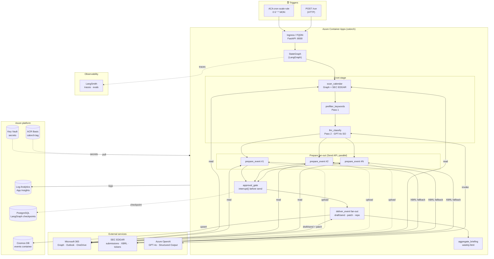
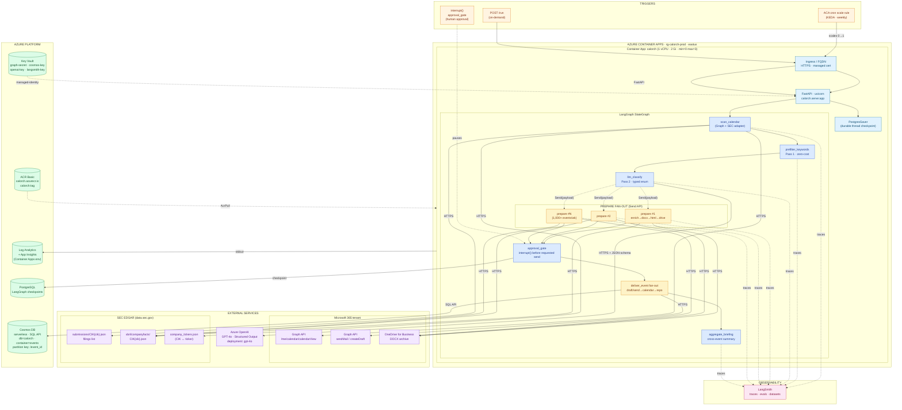
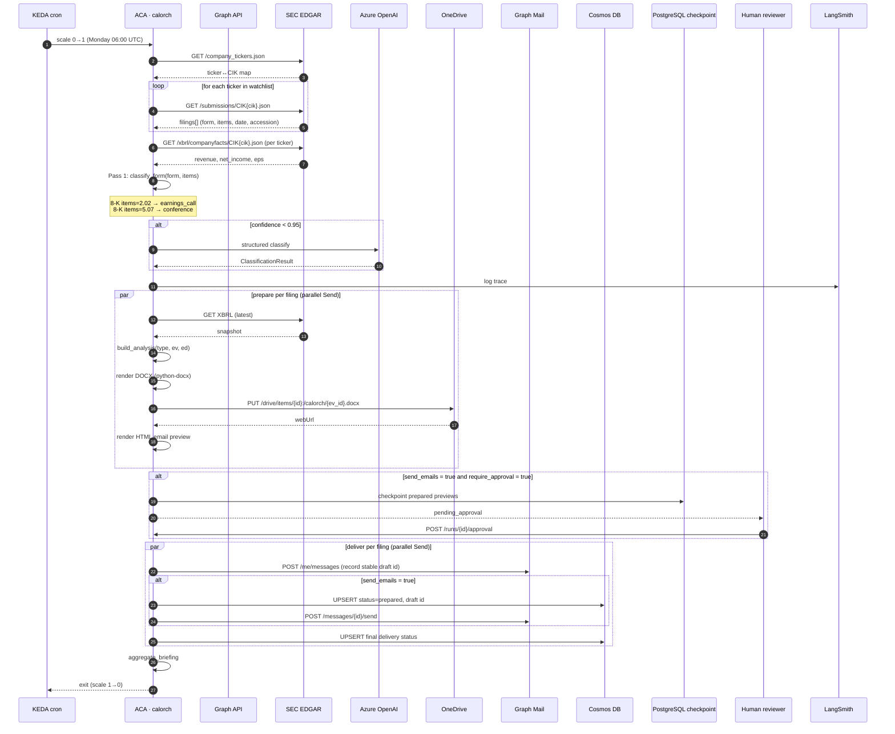
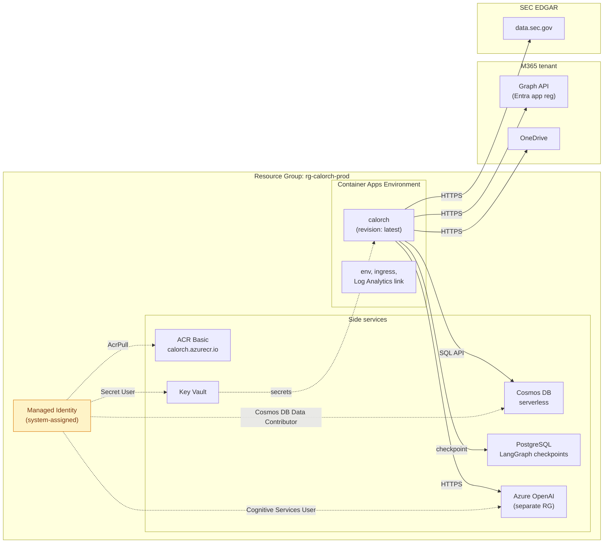
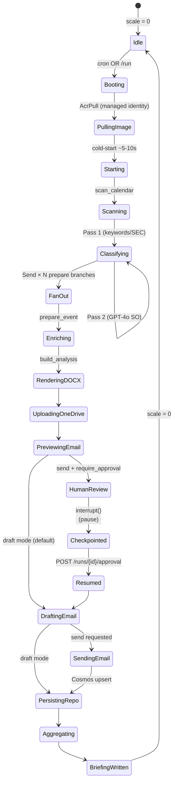

# calorch — Solution Architecture (Azure Container Apps)

> End-to-end architecture of the Calendar-Driven Intelligent Workflow
> Orchestrator, deployed on Azure Container Apps (Consumption tier).
> Covers data sources, classification, parallel fan-out, delivery,
> persistence, governance, and observability.

---

## High-level flow

---

## Detailed component diagram

---

## Data flow — single SEC filing, end to end

---

## Deployment topology

---

## Request lifecycle (human review gate)

---

## Security & governance

| Concern | Control |
|---|---|
| **Credential storage** | ACA secrets today; use Key Vault references before production rollout |
| **Container pull** | Managed identity + AcrPull role, no admin password |
| **Cosmos access** | Cosmos account key in ACA secret today; managed identity is the target hardening step |
| **OpenAI access** | Azure OpenAI key in ACA secret today; managed identity is the target hardening step |
| **Graph access** | App registration (client credentials), secret in ACA secret store |
| **HTTP API access** | `X-Calorch-API-Key` required for `/run` and `/runs/*`; health probe remains public |
| **Email draft vs send** | `send_emails=False` default — human approves per event |
| **Interrupt gate** | `approval_gate` calls `interrupt()` after previews; `POST /runs/{id}/approval` resumes |
| **SEC fair-use** | `_RateLimiter` (9 req/sec, thread-safe) + `.cache/sec/` disk cache |
| **LLM tracing** | LangSmith environment configuration; add PII redaction before enabling on sensitive calendars |
| **Network egress** | ACA outbound to Graph/EDGAR/OpenAI over HTTPS only; no VNet required at this tier |
| **Image scanning** | Enable Microsoft Defender for container registries in the Azure subscription |

---

## Cost breakdown (monthly, typical weekly job)

| Resource | Quantity | Unit | Monthly |
|---|---|---|---|
| ACR (Basic) | 1 | $5.00 | $5.00 |
| Container Apps active time | ~20 min/wk | $0.000012/vCPU-sec | $0.30 |
| Cosmos DB Serverless | 100 RUs, 50 MB | $0.25/GB | $0.05 |
| Log Analytics | 1 GB ingested | $2.30/GB | $2.30 |
| Key Vault | 10 secrets, 10k ops | $0.03/10k | $0.01 |
| Azure OpenAI (Pass 2 only) | ~5k calls/wk | ~$0.01/call | $20.00 |
| LangSmith Developer | 1 seat | $39 | $39.00 |
| **Total** | | | **~$66.66/mo** |

For a 4-week run (1,000 filings, all 8 types, 1 LLM call per filing):
- Cold-start amortised: ~10s × 4 = 40s
- Active time: ~5 min × 4 = 20 min
- LLM calls: SEC path skips Pass 2 (confidence 0.95), so only Outlook events
  invoke GPT-4o. With a 200-event Outlook calendar that's ~$8/mo.

---

## Failure modes & recovery

| Failure | Detection | Recovery |
|---|---|---|
| EDGAR rate-limited | 429 response | `_RateLimiter` backs off automatically |
| EDGAR down | connect error | Filing skipped, error logged, rest of pipeline continues |
| OneDrive 401 | token expired | MSAL refresh-token flow, transparent to caller |
| LLM timeout | OpenAI 30s default | Pass 1 hint used (confidence 0.4), error recorded |
| Cosmos write conflict | 409 from server | SDK retries with new session token |
| ACA cold-start | first weekly run | 5-10s added; LangGraph checkpointer restores from last checkpoint |
| Graph send quota | 429 from Graph | Microsoft Graph throttling headers respected (Retry-After) |
| Image pull failure | 401/403 from ACR | AcrPull role re-checked; image tag rolled back via ACA revision |

---

## Comparison with original ADR (Option C, Functions)

| Aspect | ADR Option C (Functions) | This impl (ACA) | Azure Durable Functions |
|---|---|---|---|
| Runtime | Azure Functions (Consumption) | Container Apps (Consumption) | Azure Functions (Consumption) |
| Cold start | per-function | per-revision (1x/week) | per-function |
| Per-node timeout | 5 min default, 10 min max | unbounded | 5 min default, 10 min max |
| Checkpointer | Durable Functions orchestration state | LangGraph `PostgresSaver` (`MemorySaver` only for local dev) | Built-in task hub (Azure Storage) |
| State sharing | orchestrator output binding | `configurable["context"]` injection | Orchestrator local variables (deterministic only) |
| Parallel fan-out | `task.all([...])` | `Send` API (one line) | `task_all([call_sub_orchestrator(...)])` |
| Scale to zero | yes | yes | yes |
| Cost (weekly 1k events) | Functions: ~$5; Premium EP1: ~$160 | ~$7 | ~$5–10 |
| Code complexity | N×function.json + bindings | 1 Dockerfile, 1 ACA YAML | N×activity + 1 orchestrator + bindings |
| Multi-day pauses | native (durable timers) | supported with `CHECKPOINT_POSTGRES_URI` | native (`WaitForExternalEvent` + durable timers) |
| Best for calorch? | acceptable | **yes** | poor (determinism + 10-min cap) |

The ADR's Functions architecture is preserved in spirit (per-node
boundary, durable orchestration, scale-to-zero) but realised on a
runtime that doesn't impose a 10-minute execution limit on the
per-event pipeline — important when a single event triggers
Graph + EDGAR + OpenAI + OneDrive + Outlook + Cosmos round trips.

For the full evaluation of why we chose LangGraph on ACA over Durable
Functions, see `docs/evaluations/azure-durable-functions.md`.

For the enterprise-grade data-source strategy (Refinitiv / FactSet / Tiingo
/ FRED / SEC), see `docs/evaluations/enterprise-data-sources.md`. For a
per-field gap analysis (what SEC has, what needs supplementing), see
`docs/evaluations/sec-edgar-coverage.md`.

## Data source layer (built today)

The orchestrator is wired against a `ProviderBundle` of free, official
sources plus stubs for fields that require a paid terminal:

| Provider | Real impl | Stub | Triggered by env var |
|---|---|---|---|
| Macro (VIX, 10Y, oil, …) | FRED + FOMC H.15 | `StubFredClient` + `StubFedH15Client` | `FRED_API_KEY`, `USE_FRED`, `USE_FED_H15` |
| Segments (product) | `SecIxbrlClient` (real parser) | `StubIxbrlClient` (curated AAPL/MSFT/…) | `USE_IXBRL_SEGMENTS` |
| Segments (geographic) | `SecIxbrlClient` (real parser) | `StubIxbrlClient` (curated AAPL) | `USE_IXBRL_SEGMENTS` |
| Narrative (guidance) | `SecEftsClient` (real search) | `StubEftsClient` (curated AAPL/MSFT/NVDA) | `USE_SEC_EFTS` |
| Price (52w, market cap) | (none — no free source) | `StubPriceProvider` | `TIINGO_API_KEY` (when issued) |
| Consensus (EPS est, target) | (none — no free source) | `StubConsensusProvider` | `REFINITIV_CLIENT_ID` (when issued) |

The dispatcher in `src/calorch/providers.py:build_providers()` reads
`Settings` and returns the right implementation. The renderer never knows
which one is wired.

---

**See also:** `deploy/README.md` · `IMPLEMENTATION_REVIEW.md` · `langgraph.json`
