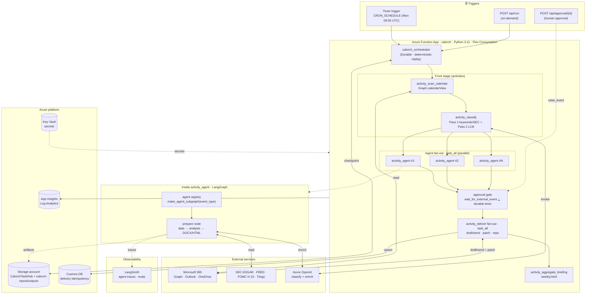
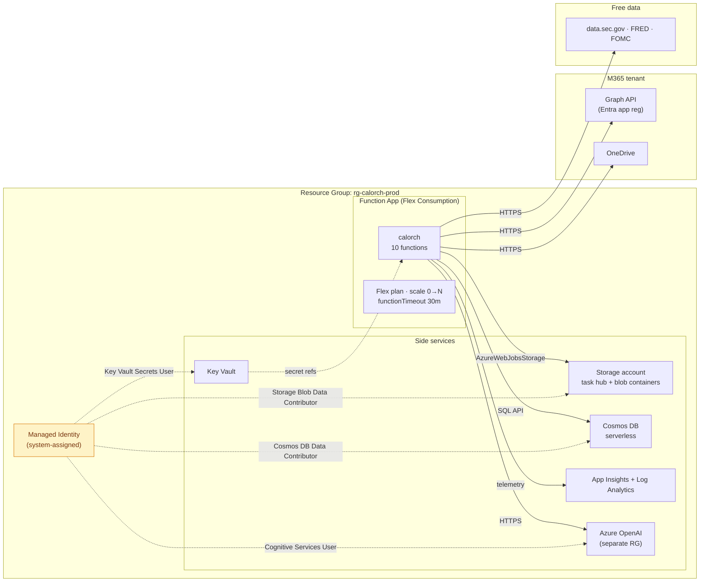
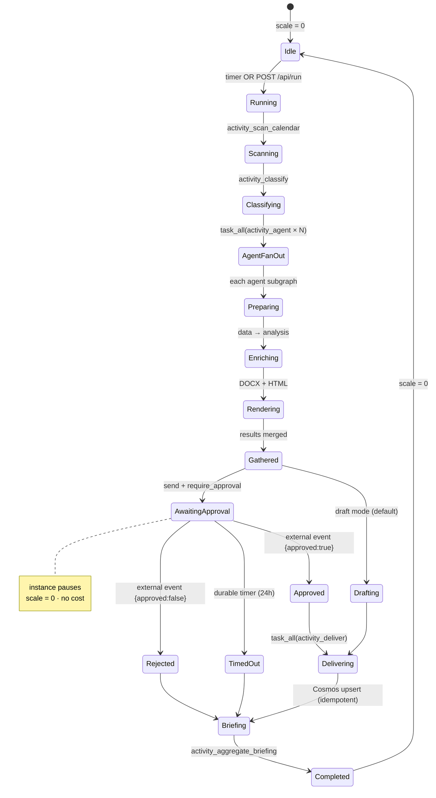

# calorch — Solution Architecture (Azure Durable Functions)

> End-to-end architecture of the Calendar-Driven Intelligent Workflow
> Orchestrator, deployed as an **Azure Durable Functions** app with
> **LangGraph** multi-agent subgraphs inside activities. Covers triggers,
> orchestration, parallel fan-out, the approval gate, delivery,
> persistence, governance, and observability.

---

## High-level flow



---

## Detailed component diagram

```mermaid
flowchart TB
    classDef trigger fill:#FFF4E1,stroke:#D97706,color:#7C2D12
    classDef container fill:#E0F2FE,stroke:#0369A1,color:#0C4A6E
    classDef stage fill:#DBEAFE,stroke:#1D4ED8,color:#1E3A8A
    classDef parallel fill:#FEF3C7,stroke:#D97706,color:#78350F
    classDef external fill:#F3E8FF,stroke:#7C3AED,color:#581C87
    classDef store fill:#DCFCE7,stroke:#15803D,color:#14532D
    classDef obs fill:#FCE7F3,stroke:#BE185D,color:#831843

    %% ====== TRIGGERS ======
    subgraph T1["TRIGGERS"]
        direction TB
        TIMER["Timer trigger<br/>CRON_SCHEDULE · weekly"]:::trigger
        HTTPC["POST /api/run<br/>(on-demand)"]:::trigger
        EXT["POST /api/approval/{id}<br/>raise_event('approval')"]:::trigger
    end

    %% ====== FUNCTION APP ======
    subgraph T2["AZURE FUNCTION APP · rg-calorch-prod · Flex Consumption"]
        direction TB
        subgraph T2A["Durable Functions host (scale 0→N)"]
            direction TB
            ORC["calorch_orchestrator<br/>deterministic · no I/O<br/>run_id = current_utc_datetime"]:::container
            HUB["Task hub (Azure Storage)<br/>history · instances · queues"]:::container

            subgraph T2B["Orchestrated activities"]
                direction LR
                N1["activity_scan_calendar<br/>(Graph)"]:::stage
                N2["activity_classify<br/>Pass 1 + Pass 2"]:::stage
                N1 --> N2

                subgraph T2C["AGENT FAN-OUT  (task_all)"]
                    direction TB
                    W1["activity_agent #1<br/>LangGraph subgraph"]:::parallel
                    W2["activity_agent #2"]:::parallel
                    WN["activity_agent #N"]:::parallel
                end
                N2 -.->|"task_all([...])"| W1
                N2 -.->|"task_all([...])"| W2
                N2 -.->|"task_all([...])"| WN

                GATE["approval gate<br/>wait_for_external_event<br/>⟂ create_timer(24h)"]:::stage
                DELIVER["activity_deliver fan-out<br/>draft/send → calendar → repo"]:::parallel
                N4["activity_aggregate_briefing<br/>cross-event summary"]:::stage
                W1 & W2 & WN --> GATE --> DELIVER --> N4
            end
            ORC --> N1
            ORC <--> HUB
            ORC --> GATE
        end
    end

    %% ====== AGENT REGISTRY ======
    subgraph T2D["AGENT REGISTRY (calorch.agents)"]
        direction TB
        SPEC["AgentSpec per event type<br/>keywords · analysis_builder · graph_factory"]:::container
        FACT["make_agent_subgraph(type)<br/>compiled StateGraph"]:::container
        SPEC --> FACT
    end
    W1 & W2 & WN -.->|invoke| FACT

    %% ====== EXTERNAL SERVICES ======
    subgraph T3["EXTERNAL SERVICES"]
        direction TB
        subgraph T3A["Microsoft 365 tenant"]
            M1["Graph · /me/calendar/calendarView"]:::external
            M2["Graph · sendMail / createDraft"]:::external
            M3["OneDrive · DOCX archive"]:::external
        end
        subgraph T3B["Free data (data.sec.gov, FRED, FOMC)"]
            S1["SEC submissions + companyfacts"]:::external
            S2["FRED + FOMC H.15 macro"]:::external
        end
        OAI["Azure OpenAI<br/>classify + enrich"]:::external
    end

    %% ====== AZURE PLATFORM ======
    subgraph T4["AZURE PLATFORM"]
        direction TB
        BLOB[("Storage · Blob<br/>calorch-inputs / calorch-outputs")]:::store
        COSMOS[("Cosmos DB<br/>serverless · /event_id<br/>delivery idempotency")]:::store
        KV[("Key Vault<br/>graph-secret · openai-key · cosmos-key")]:::store
        LA[("App Insights<br/>+ Log Analytics")]:::store
    end

    %% ====== OBSERVABILITY ======
    subgraph T5["OBSERVABILITY"]
        direction TB
        LS["LangSmith<br/>agent traces · evals"]:::obs
    end

    %% ====== EDGES ======
    TIMER --> ORC
    HTTPC --> ORC
    EXT -.->|raise_event| GATE

    N1 -->|HTTPS| M1
    N2 -->|HTTPS| OAI
    W1 & W2 & WN -->|read pre-ingested| BLOB
    W1 & W2 & WN -.->|fallback| S1
    W1 & W2 & WN -.->|macro| S2
    W1 & W2 & WN -->|enrich| OAI
    W1 & W2 & WN -->|upload| M3
    DELIVER -->|HTTPS| M2
    DELIVER -->|SQL API| COSMOS
    N4 -->|write| BLOB

    KV -.->|managed identity| T2A
    T2A -->|stdout/metrics| LA
    W1 & W2 & WN -.->|traces| LS
```



---

## Data flow — single SEC filing, end to end

```mermaid
sequenceDiagram
    autonumber
    participant K as Timer trigger
    participant O as calorch_orchestrator
    participant SC as activity_scan_calendar
    participant CL as activity_classify
    participant AG as activity_agent (LangGraph)
    participant B as Blob / SEC
    participant AI as Azure OpenAI
    participant L as OneDrive
    participant DV as activity_deliver
    participant M as Graph Mail
    participant C as Cosmos DB
    participant H as Human reviewer

    K->>O: start_new (Monday 09:00 UTC)
    Note over O: run_id = current_utc_datetime<br/>(deterministic)
    O->>SC: call_activity_with_retry
    SC-->>O: events[] + raw_events[]
    O->>CL: call_activity_with_retry(events, raw_events)
    CL->>AI: Pass 2 classify (if Pass 1 < 0.95)
    AI-->>CL: ClassificationResult
    CL-->>O: classifications{}
    par task_all(activity_agent × N)
        O->>AG: event + classification
        AG->>B: read pre-ingested data (or SEC fallback)
        AG->>AI: enrich sections (template prompts)
        AG->>AG: build_analysis → render DOCX/HTML
        AG->>L: upload DOCX
        AG-->>O: documents, prepared_emails, links
    end
    alt send_emails = true and require_approval = true
        O->>O: wait_for_external_event("approval") ⟂ create_timer(24h)
        O-->>H: instance paused (scale to zero)
        H->>O: POST /api/approval/{id} {approved:true}
        Note over O: timer cancelled; proceed
    end
    par task_all(activity_deliver × N)
        O->>DV: event + preview + document
        DV->>C: upsert prepared (stable draft id)
        DV->>M: createDraft / sendMail
        DV->>C: upsert final status
        DV-->>O: emails, followups
    end
    O->>O: activity_aggregate_briefing → weekly.html → blob
    O-->>K: orchestration Completed
```

The orchestrator code is deterministic and replayed by the host on every
event; only activities perform I/O. Delivery is idempotent per
`run_id:event_id`, so an activity retry never double-sends.

---

## Deployment topology



---

## Orchestration lifecycle (human review gate)



---

## Security & governance

| Concern | Control |
|---|---|
| **Credential storage** | Key Vault references in app settings; no secrets in plain text |
| **Blob access** | Managed identity + `Storage Blob Data Contributor` (`AZURE_STORAGE_ACCOUNT_URL`, no connection string) |
| **Cosmos access** | Cosmos key as Key Vault reference; managed identity is the hardening target |
| **OpenAI access** | Azure OpenAI key as Key Vault reference (or `Cognitive Services User` via identity) |
| **Graph access** | App registration (client credentials); scope to the research mailbox via application access policy |
| **HTTP API access** | Azure **function keys** (`?code=`) on `run`/`approval`/`status`; distribute the approval key only to approvers |
| **Email draft vs send** | `send_emails=false` default; `require_approval` gates external send per run |
| **Approval gate** | `wait_for_external_event("approval")` raced against `create_timer` (24h default, `approval_timeout_hours` override) |
| **Idempotent delivery** | repository `delivery_key` check + activity retries ⇒ at-most-once send |
| **SEC fair-use** | thread-safe rate limiter (≤10 req/sec) + on-disk cache |
| **LLM tracing** | LangSmith (optional); enable PII redaction before sensitive calendars |
| **Scratch storage** | `OUTPUT_DIR`/`SEC_CACHE_DIR`/`AUDIT_LOG_PATH` on `/tmp` (package mount is read-only) |

---

## Cost breakdown (monthly, typical weekly job)

| Resource | Quantity | Monthly |
|---|---|---|
| Function App (Flex Consumption) | ~20 min active/wk | ~$0 idle + pennies/run |
| Storage (task hub + artifacts) | history + blobs | <$1.00 |
| Cosmos DB Serverless | ~100 RUs, 50 MB | $0.05 |
| App Insights + Log Analytics | ~1 GB | ~$5.00 |
| Key Vault | 10 secrets | $0.01 |
| Azure OpenAI (Pass 2 + enrichment) | token-driven | ~$8–20 |
| LangSmith (optional) | 1 seat | $0–39 |
| **Total (no LangSmith seat)** | | **~$15–28/mo** |

The SEC fast-path skips Pass 2 (confidence ≥ 0.95), so only Outlook-sourced
events incur classification tokens. The approval pause is free — state
waits in the task hub, not on a running instance.

---

## Failure modes & recovery

| Failure | Detection | Recovery |
|---|---|---|
| Activity transient error (Graph/SEC/LLM) | exception in activity | `RetryOptions(3 attempts)` re-runs the activity |
| EDGAR rate-limited / down | 429 / connect error | rate limiter backs off; event degrades to "—", pipeline continues |
| OneDrive 401 | token expired | MSAL refresh-token flow, transparent |
| LLM timeout | provider default | Pass 1 hint used (confidence 0.4), error recorded |
| Cosmos write conflict | 409 | SDK retries with new session token |
| Worker crash mid-run | host detects | orchestration replays deterministically from task-hub history |
| Approval never arrives | durable timer | run resolves as `timed_out`, skips delivery, still briefs |
| Duplicate delivery on retry | repository `delivery_key` | recorded draft id replayed; no second send |
| Graph send quota | 429 | `Retry-After` respected |

---

## Why Durable Functions

Orchestration runs on Azure Durable Functions; the per-event agent work
runs as LangGraph subgraphs inside activities. The split lines up with
each tool's strengths:

| Concern | How Durable Functions handles it |
|---|---|
| Orchestration | Deterministic orchestrator function (replayed on every event) |
| Checkpointing | Task hub on Azure Storage — no extra database to run |
| Parallel fan-out / fan-in | `task_all([call_activity_with_retry(...)])` |
| Approval gate | `wait_for_external_event` raced against a durable timer (multi-day pauses are native) |
| Per-execution timeout | 30 min per activity (Flex Consumption) |
| Scale to zero | per-execution billing; the approval pause costs nothing |
| HTTP surface | function-key-protected triggers (`run` / `approval` / `status`) |
| Retries | `RetryOptions(3 attempts)` per activity |

The agent logic is non-deterministic (LLM calls, HTTP), so it lives inside
activities — exactly where Durable Functions wants side effects — while the
orchestrator itself stays pure and replay-safe.

The same pipeline is also assembled as a LangGraph `StateGraph`
(`calorch.graph.make_graph`) for `langgraph dev` and unit tests; it mirrors
the same nodes and agent registry, so behaviour is identical to the
activity path.

For the enterprise-grade data-source strategy (Refinitiv / FactSet / Tiingo
/ FRED / SEC), see `docs/evaluations/enterprise-data-sources.md`. For a
per-field gap analysis, see `docs/evaluations/sec-edgar-coverage.md`.

## Data source layer

The orchestrator is wired against a `ProviderBundle` of free, official
sources plus stubs for fields that require a paid terminal. In production
agents read **pre-ingested** data from `calorch-inputs`
(`USE_BLOB_PROVIDERS=true`); `calorch.data_ingestion` populates it on a
separate schedule.

| Provider | Real impl | Stub | Triggered by env var |
|---|---|---|---|
| Macro (VIX, 10Y, oil, …) | FRED + FOMC H.15 | `StubFredClient` + `StubFedH15Client` | `FRED_API_KEY`, `USE_FRED`, `USE_FED_H15` |
| Segments (product/geo) | `SecIxbrlClient` (real parser) | `StubIxbrlClient` | `USE_IXBRL_SEGMENTS` |
| Narrative (guidance) | `SecEftsClient` (real search) | `StubEftsClient` | `USE_SEC_EFTS` |
| Price (52w, market cap) | Tiingo | `StubPriceProvider` | `TIINGO_API_KEY` |
| Consensus (EPS est, target) | Tiingo | `StubConsensusProvider` | `TIINGO_API_KEY` |

The dispatcher in `src/calorch/providers.py` reads `Settings` and returns
the right implementation. The renderer never knows which one is wired.

---

**See also:** `deploy/azure-functions.md` (deployment) · `IMPLEMENTATION_REVIEW.md` · `function_app.py` · `langgraph.json`
```
